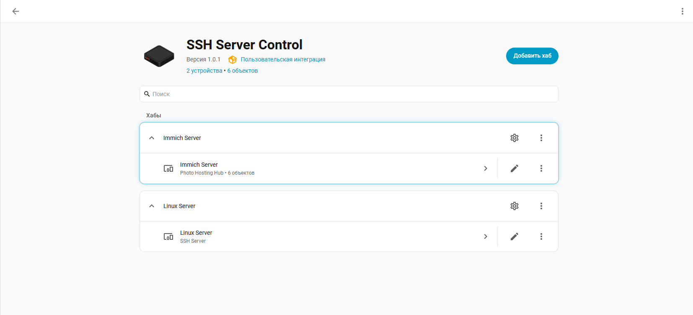
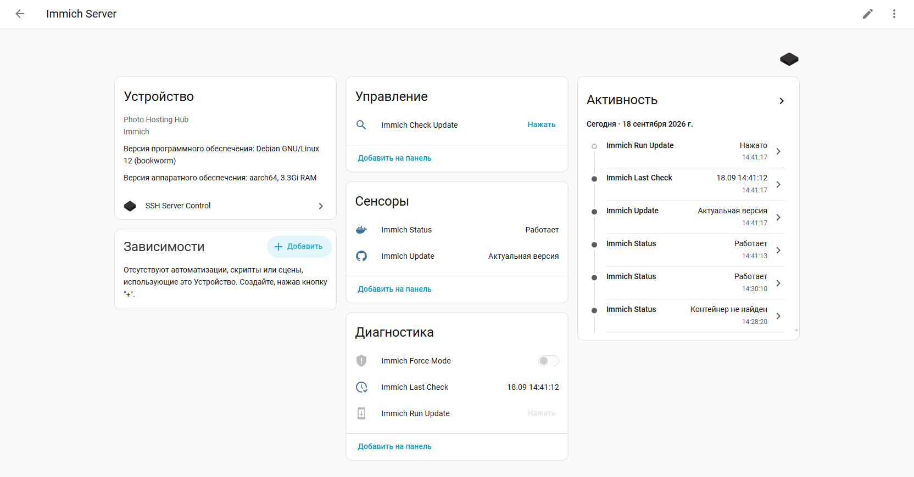

# SSH Server Control for Home Assistant

A powerful Home Assistant custom integration that transforms your system into a dynamic GUI constructor for managing any Linux server over SSH, featuring a specialized native profile for **Immich Photo Hosting Hub**.

---

## 🇷🇺 Описание на русском языке

**SSH Server Control** — это универсальная интеграция для Home Assistant, позволяющая превратить вашу систему в полноценный графический конструктор для безопасного удаленного управления и мониторинга любых Linux-серверов (компьютеров, одноплатников или ТВ-приставок, с linux на борту) по протоколу SSH с использованием приватных ключей.

### 🚀 Основные возможности (Features)

* **Мульти-хаб архитектура:** Добавляйте неограниченное количество независимых Linux-серверов через стандартный интерфейс интеграций Home Assistant. Каждому серверу задается свое имя, IP-адрес/домен, кастомный SSH-порт и пользователь.
* **Специализированный хаб Immich (Immich Photo Hosting Hub):** Родной пресет интеграции, созданный специально для комплексного управления фотохостингом Immich в Docker:
  * **Реактивный мониторинг статуса:** Сенсор отслеживает не просто текстовые состояния контейнеров, а опирается на скрытые системные атрибуты (`container_is_running`, `api_is_online`), обеспечивая нулевой оверхед процессора.
  * **Интеллектуальная предпроверка обновлений:** Запросы к GitHub API изолированы от системного поллинга, что гарантирует 100% защиту от блокировок и банов по IP.
  * **Безопасная цепочка обновлений (Safe Update Chain):** Установка обновлений в один клик с многоступенчатым контуром безопасности: автоматическая проверка активности фоновых задач Immich перед стартом ➔ горячий бэкап базы данных PostgreSQL ➔ строгая проверка валидности и размера файла дампа на диске ➔ ротация и очистка старых бэкапов по количеству и дням только в случае успеха.
* **Графический конструктор (GUI Constructor):** Нажмите на шестерёнку настроек любого добавленного сервера, чтобы прямо на лету добавлять, редактировать или удалять новые кнопки, переключатели и сенсоры без изменения кода Python.
* **Умные сенсоры (Dynamic Sensors):** Создавайте датчики для любых Bash-команд (мониторинг ОЗУ, CPU, температуры, дисков, состояния Docker). Каждому датчику можно задать свой изолированный интервал обновления в секундах и привязать единицу измерения (°C, %, МБ).
* **Многострочный редактор Jinja:** Полная нативная поддержка графического редактора шаблонов Home Assistant для полей «Шаблон доступности» (Availability Template) и «Шаблон состояния» (Value Template). Обрабатывайте сырые текстовые и JSON-ответы от сервера прямо в GUI.
* **Принудительный опрос (Force Update):** Все сенсоры поддерживают стандартную службу `homeassistant.update_entity`. Вы можете принудительно вызывать обновление датчиков из автоматизаций, Node-RED или скриптов в обход таймеров.
* **Высокая безопасность:** Подключение осуществляется строго по приватным SSH-ключам (RSA/ED25519) без использования небезопасных паролей в конфигурации.

---

## 🛠️ Installation via HACS (Установка)

1. Откройте **HACS** в интерфейсе вашего Home Assistant.
2. Нажмите на **три точки** в правом верхнем углу и выберите **Пользовательские репозитории** (Custom repositories).
3. Вставьте URL-адрес этого репозитория в поле **Репозиторий**.
4. Выберите **Интеграция** (Integration) в качестве категории и нажмите **Добавить**.
5. Найдите **SSH Server Control** в поиске HACS, скачайте его и перезагрузите Home Assistant.

---

## ⚙️ Configuration (Первичная настройка хаба)

1. Перейдите в **Настройки** ➔ **Устройства и службы** ➔ **Добавить интеграцию**.
2. Найдите в поиске **SSH Server Control**.
3. Заполните конфигурационные данные вашего сервера:
   * **Тип хаба (Hub Type):** Выберите `Generic Linux Server` для создания чистого конструктора или `Immich Server Preset` для автоматического развертывания экосистемы управления фотохостингом.
   * **Имя сервера:** Кастомное отображаемое имя для карточки устройства (например, `My Linux Server`).
   * **IP-адрес / Домен:** Сетевой адрес удаленной машины.
   * **SSH Порт:** Кастомный порт (по умолчанию 22).
   * **Имя пользователя:** Логин пользователя на сервере (например, `user` или `root`).
   * **Путь к приватному ключу:** Полный путь к вашему приватному SSH-ключу внутри контейнера Home Assistant (например, `/config/.ssh/id_rsa`).

---

## 📈 Пример карточки сущностей в интерфейсе (Dashboard Example)

Благодаря нативному трекеру шаблонов ядра Home Assistant, кнопки управления и датчики статуса обладают сквозной реактивностью и мгновенно меняют свои иконки и доступность на приборной панели при изменении состояния сервера:

### 📝 Smart Sensor Example (Пример ручной настройки датчика ОЗУ)

Чтобы добавить мониторинг свободной оперативной памяти на удаленной машине в режиме Generic-конструктора, нажмите кнопку «Настроить» на карточке интеграции и добавьте сенсор со следующими параметрами:
* **Имя сенсора:** `Свободная память`
* **Команда (Command):** `free -m | grep Mem | awk '{print $4}'`
* **Шаблон состояния (Value template):** `{{ value | int }}`
* **Единица измерения (Unit):** `MB`
* **Интервал опроса (Scan interval):** `30`

---

## 📄 License
Этот проект распространяется под лицензией MIT. Подробности см. в файле [LICENSE](LICENSE).
